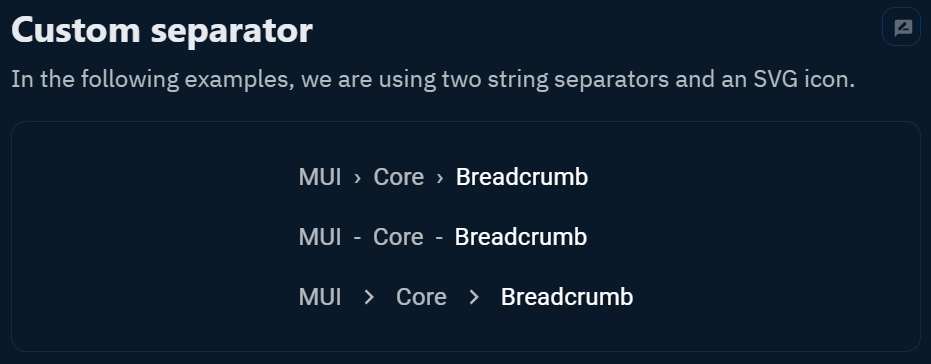

## Breadcrumb란?

웹 앱에서 사용자의 현 라우트 위치를 보여주는 UI 입니다.

많은 수의 페이지가 계층 구조로 이루어져 있을 때 사용합니다.

## react-router-dom@v6의 handle

> **[use-react-router-breadcrumbs](https://github.com/icd2k3/use-react-router-breadcrumbs)** 라이브러리를 사용하여 손쉽게 만들 수 있지만 react-router-dom@v6에서 추가된 기능으로 만드는 방법을 알아보겠습니다.

react-router-dom v6에서 추가된 **createBrowserRouter** 를 사용하여 라우트 구조를 만들 수 있습니다.

path, element, children 같은 요소말고 handle 이라는 요소는 unknown 타입으로 원하는 형식의 데이터를 넣어둘 수 있습니다.

Breadcrumb를 구성하기 위해서 handle에 label과 to를 담은 breadcrumb 객체를 넣어보겠습니다.

```typescript
import { createBrowserRouter, Navigate, Outlet } from "react-router-dom";

const Layout = () => {
  return (
    <div>
      <Breadcrumb />
      <Outlet />
    </div>
  );
};

export const AppRouter = createBrowserRouter([
  {
    element: <Layout />,
    handle: {
      breadcrumb: {
        label: "Home",
        to: "/",
      },
    },
    children: [
      {
        path: "/",
        element: <Index />, // Index 페이지 컴포넌트
      },
      {
        path: "/posts",
        element: <Outlet />,
        handle: {
          breadcrumb: {
            label: "Posts",
            to: "/posts",
          },
        },
        children: [
          {
            index: true,
            element: <Posts />, // Posts 페이지 컴포넌트
          },
          {
            path: "/posts/:id",
            element: <PostInfo />, // Post Info 페이지 컴포넌트
            handle: {
              breadcrumb: {
                label: "Post Info",
              },
            },
          },
        ],
      },
    ],
  },
]);
```

useMatches() 라는 훅을 사용하여 handle 안에 넣어둔 값을 사용할 수 있습니다.

```typescript
import { Params, useMatches } from "react-router-dom";

type Match = {
  id: string;
  pathname: string;
  params: Params<string>;
  handle?: {
    breadcrumb: {
      label: string;
      to: string;
    };
  };
};

const Breadcrumb = () => {
  // useMatches의 handle 타입이 unknown 이므로 재정의를 하여 사용합니다.
  const matches = useMatches() as Match[];

  const breadcrumbs = matches
    .filter((match) => match.handle?.breadcrumb) // breadcrumb가 있는것만 필터링
    .map((match) => match.handle?.breadcrumb);

  return (
    <div>
      {breadcrumbs.map((breadcrumb, index) => {
        // to 가 있는 경우에만 NavLink 사용
        if (breadcrumb?.to) {
          return (
            <NavLink key={`breadcrumb-key-${index}`}>
              {breadcrumb.label}
            </NavLink>
          );
        }

        // to가 없을 땐 그냥 span 태그 사용하여 라우팅 하지 않도록
        return <span key={`breadcrumb-key-${index}`}>{breadcrumb?.label}</span>;
      })}
    </div>
  );
};
```

createBrowserRouter로 생성한 객체를 <RouterProvider> 의 router에 할당합니다.

```typescript
import { AppRouter } from "./AppRouter";

export const App = () => {
  return (
    <RouterProvider
      router={AppRouter}
      fallbackElement={<div>Loading...</div>}
    />
  );
};
```

## 결과화면


## Reference

https://reactrouter.com/en/main/hooks/use-matches
